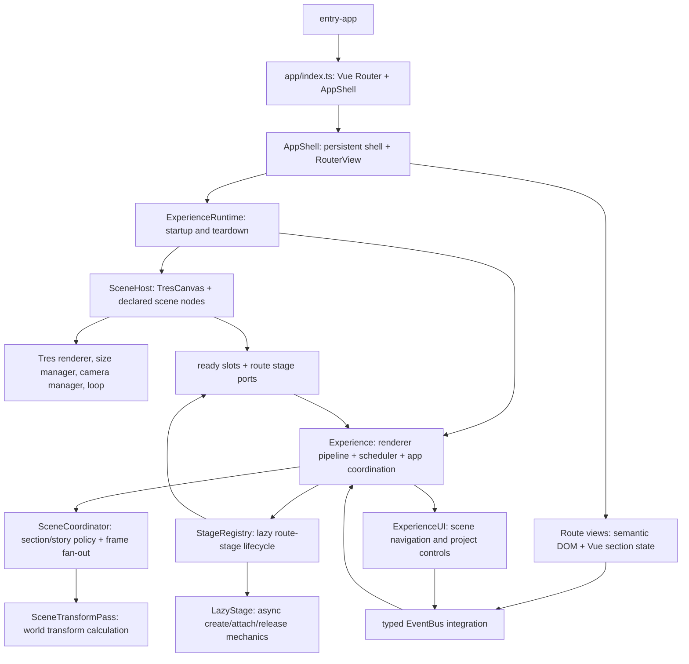

# Refactor plan — la6-portfolio

This is the repository's canonical work queue. Keep it short enough to steer
implementation: record current evidence, decisions, ordered work, and exit
conditions. Do not append session transcripts or treat passing checks as proof
that an architecture is good.

## Goal

Deliver a production-ready EN/RU portfolio with a small, understandable
codebase. Vue owns application state and declarative UI/scene composition;
TresJS owns its Vue-to-Three integration and render lifecycle where its public
API covers the need; Three.js owns rendering primitives and GPU APIs; Cientos
owns the controls/helpers it already provides. Project code should contain
portfolio behavior only: story-to-scene mapping, bespoke scene interaction,
the TSL effects that create the visual identity, and browser-specific policy
that cannot be delegated to those libraries.

Use [TvT.js v5](https://github.com/hawk86104/three-vue-tres) as a reference
for focused Vue/Tres composition and framework delegation. Its README
describes Tres as the declarative Vue interface to Three.js and identifies the
Vue/Tres stack; it also describes a broader editor, plugin, and delivery
ecosystem. This portfolio needs the former patterns, not that ecosystem.
Translate the pattern to WebGPU/TSL; do not copy TvT's unrelated product
architecture.

Success means less bespoke code and fewer competing owners, with the same
portfolio behavior and documented degradation where hardware/browser support
differs. Do not split files just to meet a line count, add generic frameworks,
or preserve a wrapper solely because a test currently encodes it.

## Audited state (2026-10-02)

- Working tree was clean at audit start; audit baseline: `f1de5ee`.
- Current review (`2026-10-02`): clean worktree at `6fbb77e`.
- Audit baseline: `src/` had 190 TS/Vue/Less files, including 35 Vitest files
  (`*.test.ts`, 2,377 lines total); Playwright had two specs under root
  `tests/`. Vitest included `src/**/*.test.ts`.
- The 35 unit files now live in `tests/unit/`, grouped by their former source
  area. Vitest and TypeScript include that test tree; relative imports were
  statically checked and all resolve. No test execution is claimed for this
  move. Playwright specs stay in root `tests/` because its config already uses
  that directory and a move is not needed to separate runtime source.
- The source has broad folders (`app`, `Experience`, `core`, `UI`, `Data`,
  `Utils`) but no consistent boundary between app/runtime policy and scene
  behavior. `Experience.ts` is 1,085 lines; `SceneHost.vue` 494;
  `StageRegistry.ts` 356; `SceneCoordinator.ts` 341;
  `SceneTransformPass.ts` 436. The first architectural task is to decide
  ownership and remove overlap, not to mechanically redistribute these files.
- `SceneHost.vue` declares TresCanvas and many scene owners, while also
  carrying renderer setup/backend-recovery coordination, ready slots, route
  policy, reduced-motion/pointer policy, and the Tres-loop bridge. Determine
  which of these are genuine host responsibilities and which can move to
  declarative Vue owners or existing Tres APIs.
- `Experience.ts` still coordinates startup, renderer adoption, world
  construction, UI/events, recovery, and render demand. The coordinator,
  registry, passes, and UI owner must be checked for policy versus forwarding
  and duplicate state. Preserve only independently justified algorithms and
  async resource ownership.
- `vite.config.ts` contains extensive hand-authored chunk rules, Three/Tres
  compatibility aliases, and a proxy-safe HMR workaround. Treat each as
  conditional technical debt: identify its reproducible consumer and current
  necessity before retaining it. Do not remove deployment workarounds without
  checking the actual hosting/proxy contract.
- Renderer-loop comparison against the installed `@tresjs/core` 5.9.2 shows
  why `Experience` still needs a project scheduler: Tres on-demand mode counts
  invalidated render frames and gates its own render callback, while this app
  advances a custom WebGPU/post pipeline from `onBeforeLoop` and runs
  animations across multiple RAF ticks. `SceneHost`'s notify-only render
  callback keeps Tres's frame counter in sync. Do not remove this scheduler
  just because the canvas also says `render-mode="on-demand"`; reassess only
  if rendering is returned to Tres's normal render callback.
- Two scene-host adapters were checked directly against the installed Tres
  5.9.2 implementation: its performance sampler reads
  `geometry.attributes.position.count` without a guard, so the cursor trail's
  empty position attribute prevents a crash before its generated ribbon is
  attached; its camera manager exposes `setActiveCamera()` and has no
  declarative `makeDefault` prop, so `CinematicCamera` must promote the camera
  after mount. Keep these narrowly scoped seams unless the library contract
  changes; do not replace them with a broader adapter abstraction.
- Source audit of the six `StageRegistry` contracts confirms real lifecycle
  differences: Works waits for card assets and owns a nested installation;
  Cyprus loads/prewarms its glTF and follows Contact section activation; Lab
  remains mounted after leaving `/lab`; the other three dispose on route exit.
  `LazyStage`'s stale-request guard, detach-before-dispose ordering, and
  deduplicated async release cover those races. Existing focused unit cases
  document these edges, but they were not run for this audit. Do not collapse
  the registry into a uniform route switch without preserving those distinct
  contracts. The runtime stage ref and mirrored Vue slot ref have distinct
  teardown timing: the registry clears runtime visibility before release,
  while the Vue ref stays populated until its `nextTick` unmount completes so
  Tres detaches the node before GPU disposal. Treat these as separate lifecycle
  state unless a replacement preserves detach-before-dispose without coupling
  the generic async lifecycle to Vue.
- Removed a frame-path config round trip in `Experience.update()`: section
  objects already reference their canonical `PhaseConfig`, so the current and
  next section configs now come directly from one sections/index snapshot.
  The active transform-phase config is also looked up once per frame and
  shared by section arrival and context-change handling. Phase lookup still
  uses `getConfig()` because its key is a transform result, not a section
  array index.
- `SceneTransformPass` no longer builds a second, hard-coded `PhaseConfig`
  when there are no sections or a section lookup fails. Its production caller
  is `Experience.update()`; the coordinator initializes all route sections
  synchronously before the first possible frame, and teardown stops the
  scheduler before disposing those sections. The fallback allocated and
  cloned camera/material/fog/post data already owned by `WorldConfig`; an
  empty section list now reports a broken lifecycle invariant. `bun run build`
  passed after removal; unit tests were not run.
- `WorldConfig` now derives its content-page key union from `PageId` in
  `routeManifest` instead of maintaining a second `CONTENT_PAGES` set and
  accepting arbitrary strings that silently fell back to home scenes. Home
  is the explicit `PageId === 'home'` branch; all other valid route ids must
  have a palette. Vue type-check, prerendering, production build, and bundle
  budgets passed; this also keeps route additions compiler-visible.
- `routeManifest.ts` now derives `PageId` from its route entries instead of
  maintaining the same six identifiers in both the type union and table. This
  makes the manifest the actual source for route ids consumed by Vue Router,
  world configuration, metadata and scene policy; full production build passed.
- TSL effects are bespoke product visuals; keep them where they express
  unique appearance. Audit repeated material/uniform setup, disposal, easing,
  shader helpers, and animation scheduling against Three/Tres/Vue APIs before
  building shared abstractions.
- Three `0.186.1` source and [WebGPURenderer docs](https://threejs.org/docs/pages/WebGPURenderer.html)
  confirm `WebGPURenderer` selects `WebGLBackend` when
  WebGPU is unavailable, and that backend compiles TSL through
  `GLSLNodeBuilder`. The project had incorrectly restricted its TSL post graph
  to native WebGPU and cleared fog on WebGL based on obsolete assumptions
  about `WebGLRenderer`/`ShaderMaterial`. Post now uses one TSL graph on either
  backend. Backend selection is Three's automatic WebGPU-to-WebGL2 behavior;
  the app does not need a second TSL/GLSL implementation. Low-tier devices
  still skip the full-screen graph as a quality policy. A separate graph
  construction error currently logs once and draws the scene directly; audit
  whether that visual degradation policy is needed. Forced-WebGL Chromium
  smoke confirmed the graph allocated and rendered without console errors.
  Firefox smoke reached `/lab` with the WebGL2 backend and one Three core URL
  after a clean reload. A duplicate-Three warning appeared during Vite's stale
  dependency optimizer reload and did not recur after reload; do not add a
  runtime dedupe layer for this transient dev condition. Firefox's Lab route
  still reports Vue's `Missing ref owner context` warning from Cientos
  `CameraControls`. WebKit and physical WebGPU remain unverified. The procedural
  circle branch in `JunniParticles` had no caller (the only owner always passes
  the Section3 sprite sheet) and was removed; this effect now has one authored
  implementation. The route handler now resets Contact scene state once before
  page-specific work, and the ambient-motion predicate no longer queries the
  same Contact typography owner twice.
- Scene-owner review has started with static transform ownership: `ServicesStageOwner`
  now declares orbit scale/rotation/position as Tres props instead of mutating
  mounted meshes, and `CinematicLights`, `GroundPlane`, and `EnvSky` use the
  same declarative props for fixed light/object positions and orientation.
  `WorksInstallation` also declares its fixed trace position as a prop while
  retaining matrix generation for its genuinely algorithmic instance layout.
  This removes setup-only Three `Vector3`/`Euler` instances and keeps imperative
  ownership for the stage's live animation. Vue type-check and full production
  build passed; this is a narrow slice, not completion of the scene audit.
- `NEXT.md` was 1,158 lines and mixed the queue with historical implementation
  narration. This rewrite is the current plan; old progress claims are not
  acceptance evidence. Re-establish evidence as phases are executed.
- A real app-start race was confirmed in `src/app/index.ts`: unmount could run
  while `mountVueApp()` awaited `router.isReady()`, after which the continuation
  mounted the app anyway. A disposed guard now prevents that remount. A focused
  regression case remains needed; no automated result is claimed yet.
- Removed a second route-mount flag from `useJlzPage`: its module-level
  `mountedOnce` survived Vue app teardown, while `app/index.ts` already owns
  and clears `window.__jlzRouterReady`. The route composable now reads that
  single app-lifecycle fact, avoiding a stale first-route announcement if the
  app is mounted again.
- Active semantic section ownership now lives in each Vue route's
  `useJlzPage()` state and template class bindings, including the shared
  contact/menu sheets. `CinematicNav` includes the selected `sectionId` in its
  page event; `ContentReveal` now applies theme policy without mutating
  `.section-active` or scheduling its own UIKit update frame. The route
  composable calls UIKit after Vue's post-flush update. `ContentReveal` no
  longer mirrors the active section id/index; it reads the Vue-rendered active
  element through one shared lookup used for initial theme, route changes, and
  theme toggles, and derives the config index from the matched config.
  Production build and home prerender succeed with exactly one initial active
  section; browser navigation behavior still needs runtime verification.
- Known release-evidence gaps from prior work: WebKit could not launch in the
  current environment; actual physical WebGPU/TSL compilation and visual
  output have not been demonstrated on a real GPU. Recheck environment and
  record these as external acceptance items if still unavailable.

## Architecture direction

Keep a shallow dependency direction:

```text
app (Vue routes, shell, page composition)
  ├─ scene (Tres declarative owners + small product scene behavior)
  ├─ content (portfolio data and static editorial sources)
  └─ platform policy only where browser APIs need an app decision
TresJS / Vue / Three.js / Cientos provide framework and rendering machinery
```

This is a target boundary, not a mandate to introduce those exact folder names.
Avoid importing application composition into leaf scene behavior. Pass only
the live values/actions a scene owner needs. Vue Router remains authoritative
for route selection; Vue/Tres remain authoritative for declared ownership;
Three owns GPU objects; every async load and GPU resource has one disposal
owner. TSL stays as direct Three TSL graphs unless repeated product behavior
proves a compact shared helper is simpler.

### Current runtime ownership (source-traced)



This is the implementation path, not the desired end state. Source trace:
`entry-app.ts` dynamically loads `app/index.ts`; `AppShell` keeps
`ExperienceRuntime` and `SceneHost` mounted beside the route view;
`ExperienceRuntime` creates `Experience` only after SceneHost emits its ready
host. SceneHost owns Tres integration and renderer setup/recovery/late disposal;
Experience adopts the scene objects and owns the custom render pipeline and
its scheduler. StageRegistry builds route-specific lazy-stage contracts and
uses Vue host ports to mount/unmount their declarative owners. The coordinator
owns story/frame policy while `SceneTransformPass` contains the transform
calculation. This source trace does not prove browser lifecycle behavior.

The reduction audit must inspect these concrete boundaries:

- `SceneHost` ↔ Tres: custom renderer, notify-only render callback, invalidate
  bridge, DPR synchronization, and deferred disposal each need a distinct
  current Tres limitation/use case before they remain.
- `Experience` ↔ `SceneCoordinator`: record every call and state owner before
  moving frame fan-out or route policy; preserve the independent render-demand
  decision and transition calculations only if their consumers need them.
- `StageRegistry` ↔ `LazyStage` ↔ `useSceneStages`: compare the six route
  contracts with their actual lifecycle differences. Keep common race-safe
  async mechanics once; do not generalize stage-specific ports merely to
  shrink this file.
- `ExperienceUI` ↔ Vue route views: identify whether any page, section, or
  navigation fact is still held by both layers before changing the event API.

## Ordered work

### 1. Correct runtime ownership and startup races — active

1. Fix the `router.isReady()` cancellation race. Define mount/unmount behavior
   for cancellation before readiness, during mount, after runtime creation,
   and on HMR; avoid a generic lifecycle state machine if a disposed guard and
   awaited teardown suffice.
2. **Source trace complete:** `app/index.ts` → `AppShell` → `ExperienceRuntime`
   → `SceneHost` and the coordinator/registry path are drawn above. Runtime
   evidence for init failure, no-scene, route changes, and teardown remains
   outstanding before this item can exit.
3. Audit SceneHost's jobs against Tres 5.9.2's installed public APIs. Remove
   duplicated loop/size/lifecycle work when Tres owns the same contract.
   Retain WebGPU adoption/recovery seams only if Tres cannot express the
   required behavior without compromising declarative scene ownership.
4. **In progress:** stage-contract and lazy-release review is complete at
   source level. Before collapsing `Experience`, `SceneCoordinator`,
   `StageRegistry`, `SceneTransformPass`, or `ExperienceUI`, record each
   public method's caller, state owner, and distinct algorithm. The concrete
   remaining candidate is the stage identity mirrored into a Vue slot; prove
   that it can be removed without adding Vue coupling to the runtime lifecycle
   helper. Keep independent transition math, route-lazy resources, or frame
   policy only when their callers require them.

**Exit evidence:** one documented ownership diagram; startup cancellation
regression covered; no duplicate route authority or renderer/loop owner;
failure and teardown paths release resources once; app and scene still work
without scene stages and with Three's automatic WebGL2 backend.

### 2. Reduce framework duplication and file-system noise

1. For each wrapper/helper, record: direct caller, behavior it adds, library
   API considered, and why deletion or delegation is safe. Apply this to
   readiness slots, lazy-stage utilities, event-bus routing, custom scheduling,
   disposal helpers, device detection, and compatibility shims.
2. Remove verified duplicate state and forwarding first; then remove dead
   exports/imports/config/comments and obsolete test scaffolding that exists
   only for removed abstractions. Do not preserve code just to keep a test
   green.
3. **Done:** moved unit tests to `tests/unit/`, preserving feature grouping;
   updated Vitest discovery and TypeScript inclusion. E2E specs remain in root
   `tests/`, the configured Playwright directory. Tests remain grouped by
   feature, not interleaved with production modules.
4. Reassess `core` and `Experience` as names: move only modules whose domain
   becomes clear after ownership decisions. Avoid a broad rename-only commit.

**Exit evidence:** all tests live outside runtime source; no stale references
or test-only production hooks; every retained utility has a distinct use;
source and bundle deltas are recorded against the audit baseline.

### 3. Simplify scene and WebGPU/TSL implementation

1. Inventory every scene owner and classify it as declarative stable geometry,
   loaded asset, algorithmic TSL object, or route-lazy feature. Prefer Vue/Tres
   declarations for stable hierarchy/props; use imperative Three only for
   generated geometry, custom algorithms, offscreen rendering, or APIs not
   represented by Tres. **In progress:** static transforms in five owners now
   live in Tres props; continue the inventory before claiming coverage.
2. Compare each Cientos/control/material/loader/lifecycle use with its current
   Tres/Three equivalent. Remove hand-built equivalents only after behavior
   and lifecycle parity are understood.
3. Audit render loop ownership and demand invalidation. Ensure one scheduler
   owns frame production; avoid component-local RAFs where Tres loop policy
   fits. Keep continuous work only for visible animation and ensure idle scenes
   stop requesting frames.
4. Audit renderer, post-processing, TSL parameters, and backend policy. Delete
   duplicated backend/capability state and graph plumbing; keep bespoke TSL
   effects. Verify the same TSL scene and post graph on WebGPU and WebGL2,
   then document only concrete backend feature gaps. Avoid premature shader
   abstraction.
5. Audit allocation in frame/update methods and GPU lifetime per scene owner.
   Remove repeated allocations, redundant traversals and defensive branches
   that the actual input contract rules out. Do not optimize by guesswork.

**Exit evidence:** each scene object has a clear Vue/Tres or algorithmic owner;
one frame policy; the same TSL graph is exercised on WebGPUBackend and
WebGLBackend in supported browsers, with no app-authored shader fallback;
no resource leak across route cycles; representative GPU captures or measured
frame/allocation evidence for claimed performance improvements.

### 4. Production boundary and release cleanup

1. Review accessibility/semantic DOM, route errors, no-renderer experience,
   responsive layouts, reduced motion, locale switching, and direct-entry
   routes as product behavior, not incidental test assertions.
2. Validate scripts, generated/prerendered blog, sitemap, content/media paths,
   and release artifact policy. Identify the real deployment consumer before
   changing tracked `dist/` or proxy/HMR behavior.
3. Remove dead styles/components and minify UI only after architecture work;
   this is a separate scope from scene/runtime ownership.
4. Re-audit the full tree for old/new parallel implementations, duplicated
   library behavior, unused dependencies, stale docs, and unexplained build
   shims. Update this plan from findings; stop when remaining complexity has
   a named product/technical owner and evidence.

**Exit evidence:** clean install and production build; automated route/lifecycle
coverage in available engines; Firefox/Chromium/WebKit evidence as available;
real WebGPU/TSL verification on supported hardware; automatic WebGL2 backend
selection verified when WebGPU is unavailable; no
unexplained compatibility seam; deployment, content, and accessibility limits
are explicit.

## Working rules

- Read repository instructions and affected callers before changing ownership.
- Make complete architectural slices, not line-count-only splits. Remove the
  obsolete path in the same change that replaces it.
- Use checks to verify changed behavior; do not treat a passing suite as proof
  that the current architecture should stay.
- Do not claim browser/GPU/performance evidence beyond what was exercised.
- Update this document when an exit condition is met or audit evidence changes.
- Commit coherent completed slices with a message that says what ownership or
  duplication changed.

## Current status

Phase 1 is active. Startup cancellation now has a guard; its focused
regression case and runtime ownership trace remain. A duplicate route-mount
flag and imperative section-class owner have been removed. Phase 2 is active:
unit tests have been relocated and redundant per-frame config lookups removed;
next continue the ownership audit before selecting a broader collapse.
Phases 3–4 are pending audit evidence; no production-ready claim is made.
Keep this status current after each completed slice.
